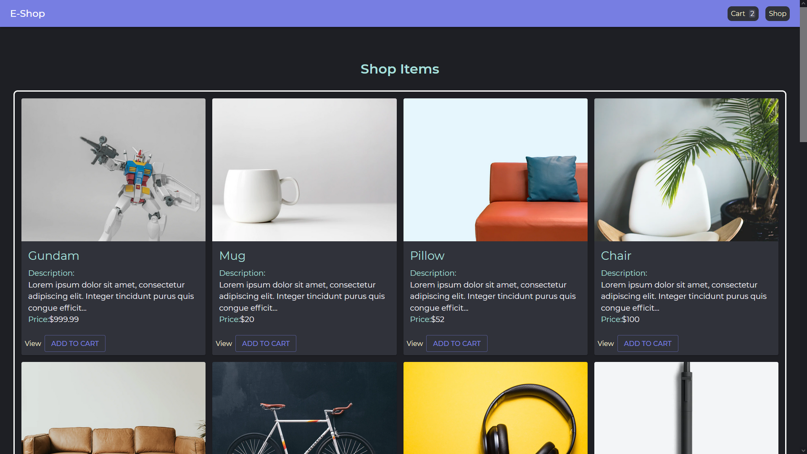
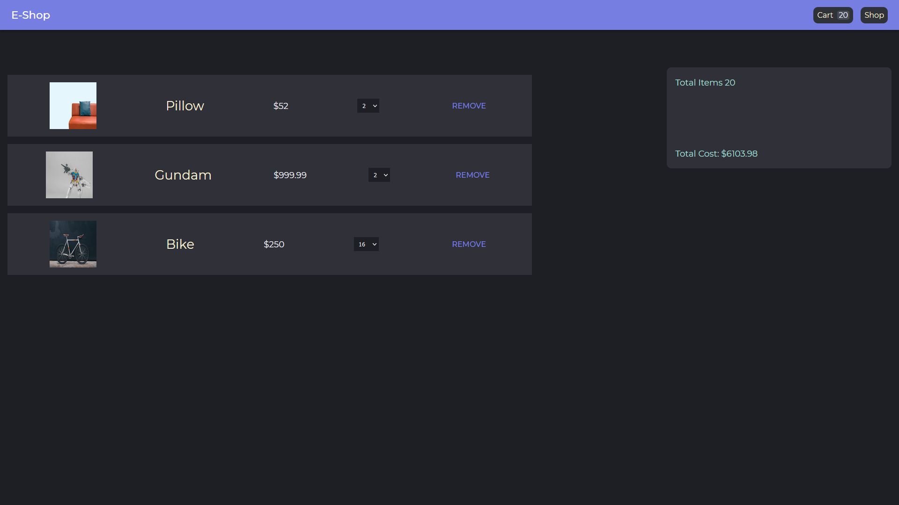
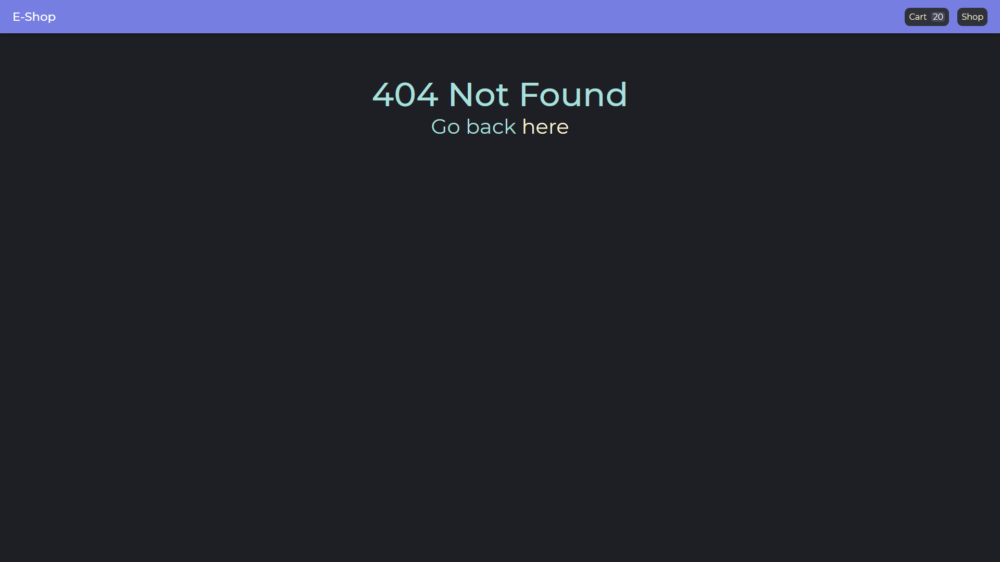
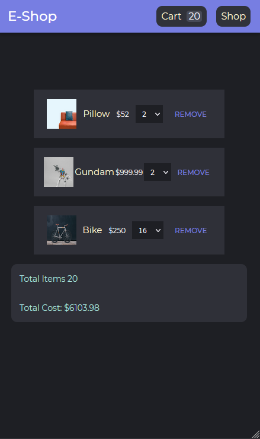
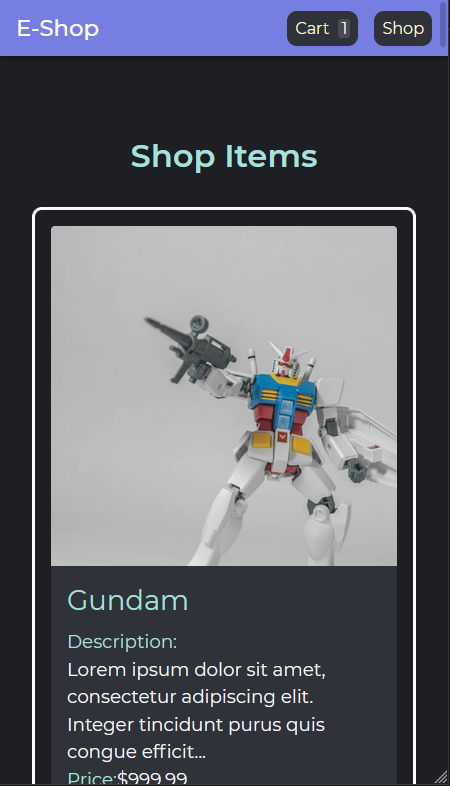

# react-eshop
My E-commerce Personal Project.

## Scripts
### **npm run dev** runs back-end and front-end concurrently.
### **npm run client** runs only client side
### **npm run seeder** runs a seeder file that imports data to the database
### **npm run server** runs server side only with nodemon

# **Back-end Dependencies**
- Express, for building a server.
- Mongoose for database.
- Dotenv for hiding environment variables.

# TODO
- Add Login/Register
- Add comment section
- Add star rating

# Project look

